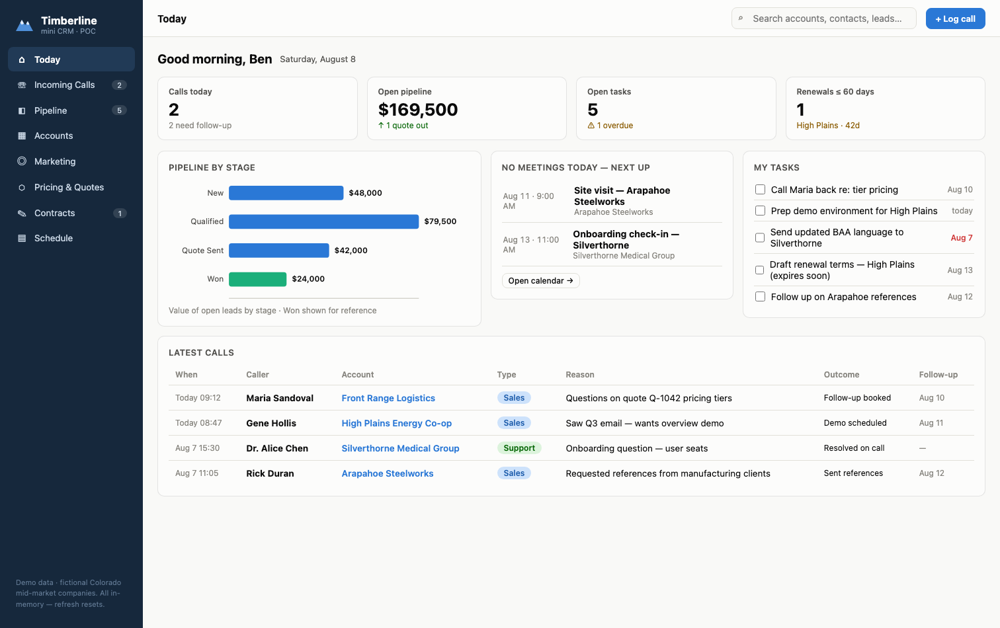
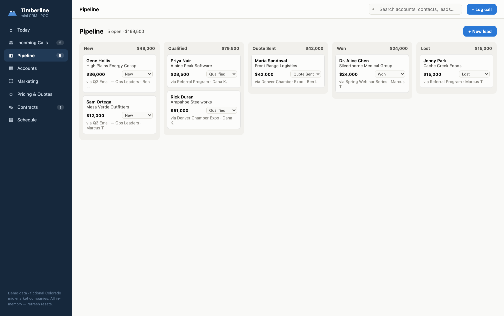
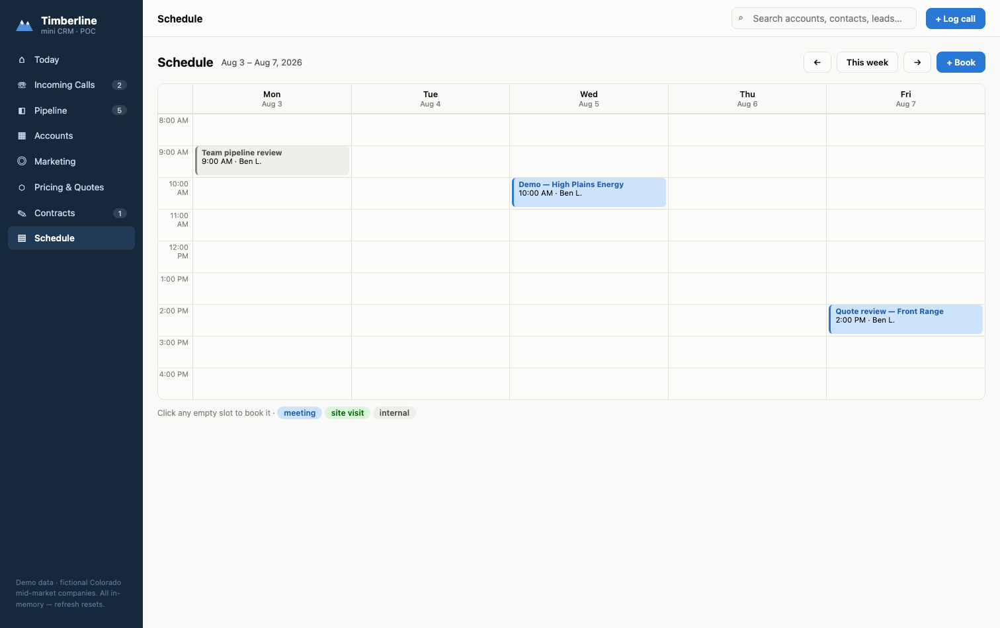

# Timberline CRM — mini CRM POC

A single-file, zero-dependency mini CRM proof of concept aimed at mid-market companies. Think Salesforce-style concepts at 10% of the weight: one simple hub for day-to-day operations.

**Demo:** open `index.html` in any browser. No build, no server, no install. All data is in-memory demo data (fictional Colorado companies) — refreshing the page resets it.

## Modules

| Module | What it does |
|---|---|
| **Today** | Dashboard: calls, open pipeline, tasks, renewals ≤ 60 days, pipeline-by-stage chart |
| **Incoming Calls** | Log every call (caller, reason, outcome, follow-up); one-click convert call → lead |
| **Pipeline** | Lead board across five stages: New → Qualified → Quote Sent → Won / Lost |
| **Accounts** | Companies with contacts, commercial summary, and a full activity timeline |
| **Marketing** | Campaigns with lead attribution, cost per lead, and closed-won tracking |
| **Pricing** | Price book + quote builder with live totals and a discount-approval guard (>15%) |
| **Contracts** | Draft → Sent → Signed → Active pipeline, renewal alerts, one-click renew |
| **Schedule** | Week calendar; book from any record; double-booking conflict warnings |

### Pipeline

### Schedule

## Architecture notes

Everything lives in `index.html`, organized top to bottom in four layers.

**1. Design tokens & CSS.** All colors are CSS variables in `:root` — `--blue` for primary actions, `--good`/`--warning`/`--critical` for status, `--nav-bg` for the sidebar. Rebrand by editing ~6 variables. Below that are component styles: `.card`, `.pill` (status badges), `.tile` (dashboard stats), `.board`/`.lane` (pipeline), `.week`/`.appt` (calendar), plus the modal and toast.

**2. Data store (the `S` object).** Plain in-memory JavaScript — effectively a draft database schema. It mirrors the Miro data model: `accounts`, `contacts`, `campaigns`, `leads`, `calls`, `priceBook`, `quotes`, `contracts`, `tasks`, `appts`. Records link by ID (`accountId`, `quoteId`, `source` → campaign), which is what makes the account timeline and campaign attribution work. Demo dates are computed relative to today (`iso(addD(today,-6))` = 6 days ago), so the demo never looks stale. To customize the demo, this is the only section you touch.

**3. The router.** `go(view, arg)` sets the current view and calls `render()`, which redraws sidebar badges and dispatches to the right view function (`vDashboard`, `vCalls`, …). No framework — each view builds an HTML string from `S` and sets `main.innerHTML`. Also here: `openModal()`/`toast()` for forms and feedback, and the global search that scans accounts, contacts, leads, quotes, and contracts.

**4. The views** — one function per module. The interesting flows:
- `convertCall()` turns a call row into a New lead (the "front door" principle from the board).
- The quote builder keeps a `qDraft` object and recalculates totals live, flagging discounts over 15% for approval.
- `quoteToContract()` drafts a contract from an accepted quote — the lead-to-cash chain.
- `contractPill()` computes renewal urgency (amber warning inside 60 days); `renewContract()` extends a year.
- `saveBooking()` checks for time conflicts before booking and asks you to confirm double-booking.

Deliberately no framework, storage, or backend — this is a POC for validating the workflow (call → lead → quote → contract → schedule) before investing in a real stack.

## Demo script

Log a call → convert to lead → move it to Quote Sent → build the quote in Pricing → mark accepted → create contract → send/sign/activate → book the kickoff in Schedule. Every step leaves a trace on the account's timeline.

## Roadmap

- **Now:** accounts & contacts, call log, today dashboard, lead pipeline
- **Next:** quote builder & price book, contract tracking & renewal alerts, calendar scheduling, campaign attribution
- **Later:** in-app email campaigns, VoIP screen-pop, e-signature, customer self-booking

## License

MIT
